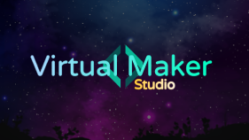
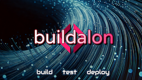
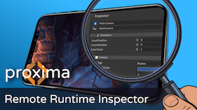
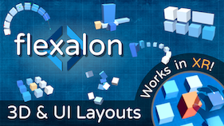
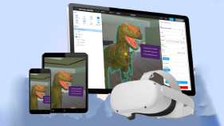

 

We're a small studio of technical experts accelerating projects to completion. With over two decades of combined experience in 3D development and Unity, *our mission is to to help our clients and users deliver exceptional products and experiences.*

## Resources

| | |
|:---:|:---|
|    [**Our Blog**](https://www.virtualmaker.dev?utm_source=company_readme) | A resource with plenty of lessons and insights. We try to post regularly. |
|    [**Buildalon**](https://www.buildalon.com/?utm_source=company_readme) | A comprehensive suite of automation tools to help developers build, test, and deploy their projects faster. |
|    [**Proxima Inspector**](https://www.unityproxima.com/?utm_source=company_readme) | Tool to connect to your live game from a web browser to inspect and edit any property. |
|    [**Flexalon**](https://www.flexalon.com/?utm_source=company_readme) | A Unity Asset that lets you create adaptive 3D layouts that are precise and easy to update. |
|    [**Virtual Maker VR/3D**](https://www.virtualmaker.net/?utm_source=company_readme) | An in-browser editor to make interactive 3D and VR scenes. |

## Services

Us at Virtual Maker can work with you on your Unity and web projects to improve your devops, implement core features, and solve your technical/programming problems.

